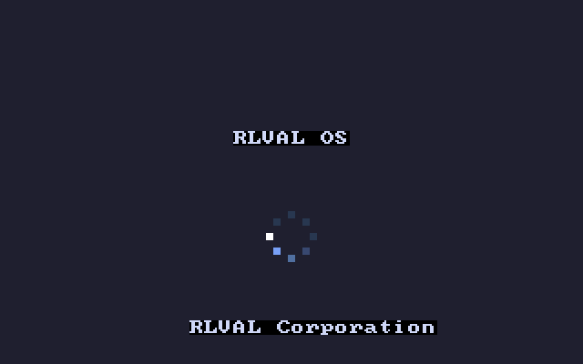
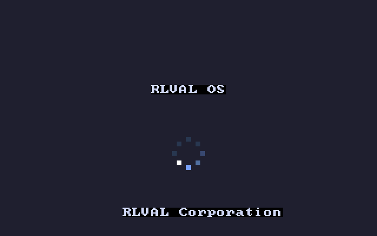
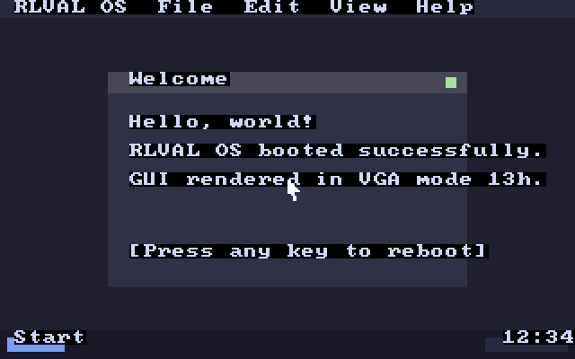

# RLVAL OS — a tiny real bootable operating system

A small but **genuinely real** x86 operating system that boots from a 512-byte
boot sector, switches the VGA card into 320×200 256-color graphics mode, and
displays a **Windows 11-style boot screen** (logo + rotating dot spinner)
before transitioning to a minimal modern-dark GUI desktop.

Written in pure NASM x86 assembly — no kernel, no libraries, no Linux
underneath. It runs on the bare metal of a virtual (or real) PC.

## Screenshots

### BIOS Setup Menu (ESC during boot)


### Boot screen (Windows 11-style rotating spinner)

| Frame 1 (head at left) | Frame 2 (head rotated to bottom) |
|---|---|
|  |  |

Notice how the bright white "head" dot moves around the ring, with a fading
blue trail behind it — the same comet-on-a-circle motion Windows 11 uses
during boot and sign-in.

### Desktop



## What's in the box

| File | Purpose |
|---|---|
| `boot.asm` | 512-byte stage-1 bootloader with BIOS Setup trigger |
| `kernel.asm` | The kernel: mode-13h graphics, palette, spinner animation, desktop GUI |
| `build.sh` | Assembles both files and produces a bootable floppy image |
| **`rlval.img`** | The 1.44 MB bootable disk image (give this to QEMU) |

## Requirements

You need two tools installed on your computer:

1. **NASM** — only required if you want to rebuild from source
2. **QEMU** (`qemu-system-i386`) — to actually run the OS

### Install

```bash
# Debian/Ubuntu
sudo apt-get install nasm qemu-system-x86

# macOS (Homebrew)
brew install nasm qemu

# Windows: download NASM from nasm.us and QEMU from qemu.org
```

## How to run it

The disk image is already built. Just point QEMU at it:

```bash
qemu-system-i386 -fda rlval.img -boot a
```

A QEMU window will open and you'll see:

1. BIOS POST, then `RLVAL OS - Press ESC for Setup...` from the bootloader.
   - Press **ESC** now to enter the BIOS Setup Menu.
2. **Boot screen**: dark background, "RLVAL OS" wordmark, rotating spinner
   of dots, "RLVAL Corporation" footer. (Now with an extended animation duration!)
3. **Desktop** appears: top menu bar, "Welcome" window with text, taskbar.
4. **Press any key** to reboot (warm `INT 19h`).

### Alternative invocations

```bash
qemu-system-x86_64 -fda rlval.img -boot a                          # 64-bit emulator works too
qemu-system-i386 -drive file=rlval.img,format=raw,if=floppy -boot a  # silences raw-format warning
```

## Rebuilding from source

```bash
./build.sh           # rebuild boot.bin, kernel.bin, rlval.img
./build.sh run       # rebuild and immediately launch in QEMU
./build.sh clean     # delete build artifacts
```

## Running on other hypervisors / real hardware

### VirtualBox
1. New VM → Type: Other, Version: Other/Unknown
2. RAM: 64 MB is plenty; **don't** create a hard disk
3. Settings → Storage → Floppy controller → add `rlval.img`
4. Settings → System → Boot Order: Floppy first
5. Start

### VMware
1. New VM → "I will install the OS later" → Other / Other
2. Customize hardware → add **Floppy** drive → use `rlval.img`

### Real USB stick ⚠️ (destroys target drive — be careful!)
```bash
# Linux
sudo dd if=rlval.img of=/dev/sdX bs=512 conv=fsync     # X = your USB stick
# macOS
sudo dd if=rlval.img of=/dev/diskN bs=512               # N = your USB disk
```
Then boot the target PC from USB. Works best on PCs with legacy BIOS / CSM
enabled; many modern UEFI-only machines won't boot this floppy-style image.

## How the Windows 11 spinner works

Real Windows 11 displays a circle of small dots where one or two are brightest
and the rest fade off behind. The bright "head" rotates around the ring,
creating a comet-like motion. We replicate this in `draw_spinner` (kernel.asm):

- 8 dots arranged on a circle of radius 12 around (160, 130), at 45° intervals.
- Each frame, `head = frame % 8` picks which dot is currently brightest.
- For each dot `i`, distance behind head is `(head - i) & 7`.
  - Distance 0 → palette index 8 (pure white) — the head
  - Distance 1 → index 3 (bright accent blue)
  - Distance 2 → index 11 (mid blue)
  - Distance 3 → index 12 (dim blue)
  - Distance 4+ → index 13 (very dim, almost background) — the "off" dots
- We programmed those palette colors via the VGA DAC (ports `0x3C8` / `0x3C9`)
  during `install_palette`.
- Each frame we erase a 32×32 box behind the spinner and redraw all 8 dots
  with the rotated brightness pattern.

## Technical notes

- **Boot sector** (`boot.asm`): 512 bytes, ends with the magic `0xAA55` BIOS
  signature. Now includes a timed loop to check for the ESC key to enter a
  mock BIOS Setup menu. Uses `INT 13h` (BIOS sector read) to copy 32 sectors to
  memory at segment `0x1000`, then far-jumps there.
- **Kernel** (`kernel.asm`): stays in 16-bit real mode. Enters VGA mode 13h via
  `INT 10h, AX=0013h` — a flat 64 KB framebuffer at `0xA0000`, one byte per
  pixel, each byte a palette index.
- **Custom palette**: First 16 DAC entries programmed via I/O for our
  modern-dark colors plus the 4 brightness levels needed by the spinner trail.
- **Drawing primitive**: A single `fill_rect` that reads its args from globals
  (`rx`, `ry`, `rw`, `rh`, `rc`) — avoids fragile register juggling in 16-bit.
- **Text**: BIOS teletype `INT 10h, AH=0Eh` (works in mode 13h, uses the
  built-in 8×8 BIOS font — no need to ship a font).
- **Reboot**: `INT 19h` warm reboot.

## Limitations (it's a toy OS!)

- No protected mode, paging, or multitasking
- No real mouse driver (cursor drawn at a fixed position)
- No keyboard input beyond "press any key to reboot" and the ESC setup trigger
- No filesystem
- Animation timing is a busy-loop calibrated for QEMU on a modern host; speed
  will vary on real hardware

## License

Public domain / CC0. Hack on it freely.
